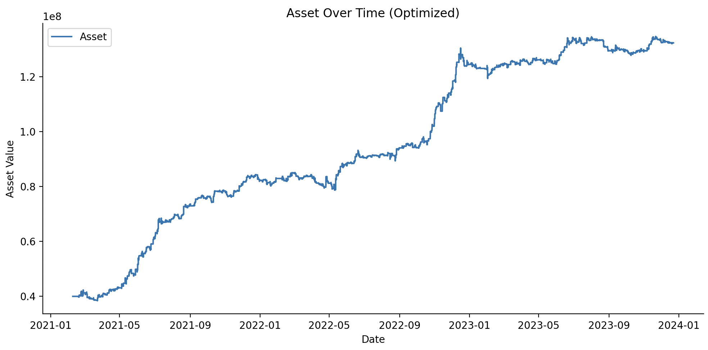

# Abstract

This project presents the design, implementation, and evaluation of a hybrid trading strategy tailored for the VN30F1M futures index. The strategy combines two widely recognized technical indicators: the 100-period Simple Moving Average (SMA-100) and the 14-period Relative Strength Index (RSI-14). By integrating the concepts of trend-following and mean-reversion, the strategy seeks to exploit temporary mispricings in the market. Specifically, it generates trading signals when the RSI reaches extreme levels—indicating overbought or oversold conditions—relative to the direction of the SMA-defined trend. These entry signals are then evaluated for profitability within the broader context of the prevailing market regime. We utilize historical price data provided by Algotrade to backtest the strategy across multiple timeframes and market conditions. Key performance metrics, including cumulative returns, Sharpe ratio, and maximum drawdown, are used to assess robustness and risk-adjusted performance. The results indicate that the hybrid approach holds potential for consistent profitability, particularly during trending but volatile market phases, underscoring the value of blending momentum and reversal signals in systematic trading.


# 1. Introduction

In recent years, algorithmic trading has revolutionized financial markets by enabling systematic, rule-based decision-making that minimizes human emotion and error. These algorithms can process vast amounts of market data in real time and execute trades based on predefined strategies, significantly improving efficiency and consistency in trading operations. Two of the most commonly used strategies in this domain are momentum strategies, which follow the direction of existing trends, and mean-reversion strategies, which capitalize on the tendency of prices to revert to their historical average after reaching extreme levels.

This project explores a hybrid approach that synthesizes both strategy types, focusing on the VN30F1M futures contract—a key derivative instrument tied to the VN30 Index, which tracks the 30 largest and most liquid stocks on the Ho Chi Minh Stock Exchange. The VN30F1M is known for its high trading volume and price volatility, making it an ideal candidate for technical-based trading strategies.

The foundation of the hybrid strategy lies in the use of two technical indicators:
- The Simple Moving Average (SMA) with a 100-period window serves as a proxy for long-term market trend direction, helping to identify whether the overall sentiment is bullish or bearish.
- The Relative Strength Index (RSI) with a 14-period window is used to detect short-term momentum extremes. When RSI values cross certain thresholds—typically above 70 for overbought and below 30 for oversold conditions—they may signal potential turning points in price action.

By aligning RSI signals with the direction suggested by the SMA, the strategy aims to enter trades with higher probability setups, favoring mean-reversion trades that are in harmony with the broader trend. This hybrid structure is designed to reduce false signals and improve trade timing, which are common challenges in purely mean-reversion or momentum-based systems.

# 2. Related Work / Background

This section introduces foundational concepts in **technical analysis** that our strategy builds upon, specifically the **Simple Moving Average (SMA)** and the **Relative Strength Index (RSI)**.

###  Simple Moving Average (SMA)
The **Simple Moving Average (SMA)** is a widely used trend-following indicator that smooths price data by averaging closing prices over a fixed time window. It helps identify the general direction of market momentum and filters out short-term noise.

**Formula:**

```
SMAₜ = (Pₜ + Pₜ₋₁ + ... + Pₜ₋ₙ₊₁) / n
```

Where:
- `SMA_t` is the SMA at time `t`
- `n` is the window size (e.g., 100)
- `P_t` is the closing price at time `t`

**Usage in our strategy:**
- Go **long** only when price is **above** the SMA (bullish trend)
- Go **short** only when price is **below** the SMA (bearish trend)

---

###  Relative Strength Index (RSI)
The **Relative Strength Index (RSI)** is a momentum oscillator that measures the magnitude of recent price changes to evaluate overbought or oversold conditions in the price of an asset.

**Basic formula:**

```
RS = Average Gain / Average Loss
RSI = 100 - (100 / (1 + RS))
```

RSI values range from 0 to 100:
- RSI > 70 → Overbought (potential for downward reversal)
- RSI < 30 → Oversold (potential for upward reversal)

In our strategy:
- **Long entry** when RSI is **low** (e.g., below 30) and price is above SMA
- **Short entry** when RSI is **high** (e.g., above 70) and price is below SMA

---

###  Strategic Combination
By combining SMA and RSI:
- **SMA** acts as a **trend filter**
- **RSI** provides **entry timing** for mean-reversion opportunities

This hybrid approach blends momentum and mean-reversion principles to improve signal quality and reduce noise in trade decisions.


# 3. Trading (Algorithm) Hypotheses

In volatile markets like the VN30F1M futures index, price movements often exhibit both trend-following characteristics during strong momentum phases and mean-reverting behavior during overbought or oversold corrections. Our trading hypothesis aims to exploit market inefficiencies by combining these two regimes into a single hybrid strategy:

#### Hypothesis Statement
> When the Relative Strength Index (RSI) indicates oversold or overbought conditions and aligns with the broader trend confirmed by a slower-moving average, prices are  >likely to revert to their mean. This creates opportunities to trade counter to short-term extremes while respecting the dominant trend.

#### Rationale 
The core premise behind this hypothesis is that short-term overreactions in price — often captured by RSI — have a higher likelihood of mean-reverting when the trade is aligned with the underlying trend direction, measured by the Simple Moving Average (SMA).
We combine both trend-following and mean-reversion signals to form a hybrid strategy.
<br> <br>

### ENTRY conditions:
#### Long Position (Buy Futures) :
- `RSI < RSI_lower threshold` (e.g., < 30) → oversold condition
- `Price > SMA` → confirms bullish trend
- `Sufficient capital` to meet margin requirement
#### Short Position (Sell Futures)
- `RSI > RSI_upper threshold` (e.g., > 70) → overbought condition
- `Price < SMA` → confirms bearish trend
- `Sufficient capital` to meet margin requirement.
  
This logic ensures that positions are only opened when a potential reversal is aligned with the dominant trend regime.

### EXIT conditions:
#### LONG positions:
- `RSI > 40` → market no longer oversold
- Price crosses **below** SMA → trend may be reversing
- Stop-loss triggered: Price **drops** more than **1.5%** from entry
#### SHORT positions:
- `RSI < 60` → market no longer overbought
- Price crosses **above** SMA → trend may be reversing
- Stop-loss triggered: Price **rises** more than **1.5%** from entry.

After closing a position, realized P&L is added to capital, and the system becomes eligible to open a new position the next day (if entry conditions are met)

# 4. Project Structure

This project is organized in a modular and extensible format. Below is an overview of the key files and folders and their roles within the system.

```bash
Group9/
├── config/
├── data/
│   ├── in_sample_data.csv     # Preprocessed historical data for training
│   ├── out_sample_data.csv    # Preprocessed historical data for evaluation
├── graph/
│   └── ...                    # Charts and figures generated during backtest/optimization
├── src/
│   ├── backtest.py            # Main script for in-sample and out-sample backtesting
│   ├── optimize.py            # Parameter tuning script using Optuna
│   ├── strategy.py            # Core trading strategy logic (entry/exit rules)
│   ├── evaluate.py            # Utility functions to compute Sharpe ratio, drawdown, return
│   ├── data.py                # Data loading and preprocessing functions
│   └── utils.py               # (Optional) visualization helpers
├── best_params.json           # Saved best parameters from optimization
├── requirements.txt           # Python dependencies
├── README.md                  # Project documentation
```

### 🔍 Key Components

- **`src/strategy.py`**  
  Implements the main trading strategy. Contains logic for SMA/RSI signal generation, trade execution, and asset value tracking.

- **`src/backtest.py`**  
  Used to evaluate strategy performance on historical data. Calculates key metrics and visualizes asset growth over time.

- **`src/optimize.py`**  
  Performs hyperparameter optimization using Optuna to identify the most profitable SMA/RSI values.

- **`src/data.py`**  
  Handles data collection, formatting, and cleaning. Can fetch data from local or online sources.

- **`src/evaluate.py`**  
  Calculate Metrics: Sharpe ratio, drawdown, return calculations.

- **`graph/`**  
  Stores all backtesting/optimization charts for reporting or analysis.


You can easily extend the project with additional strategies, evaluation metrics, or data sources by adding new modules under the `src/` folder.


# 5. Data

## Data Overview

- **Source**: [Algotrade Internship Database]
- **Format**: CSV
- **Instrument**: VN30F1M futures
- **Timeframe**:
  - **In-Sample**: 2021-02-08 → 2023-12-22
  - **Out-of-Sample**: 2023-12-22 → 2025-03-19

<p align="center">
  
  
</p>


##  How to Access the Data

You can obtain the required datasets in either of the following ways:

####  Option 1: Download Manually

- Download from Google Drive: [🔗 Data Folder](https://drive.google.com/drive/folders/1bK3aXEVfabASZs2xV8VBXYA0mXjQtB-A?usp=sharing)
- After downloading, extract the contents into the project’s `data/` folder.

####  Option 2: Fetch Automatically via Script

Run the following command from the project root to fetch and process the data:

```bash
python -m src.data
```

This will automatically generate the following files in the `data/` folder:
- in_sample_data.csv
- out_sample_data.csv
> Please be patient ^^ the script may take a few minutes to complete.

## Data Collection & Preprocessing
- Raw price data of VN30F1M was extracted using below SQL queries from the Algotrade database:
```sql
SELECT m.datetime, m.tickersymbol, m.price
FROM "quote"."matched" m
LEFT JOIN "quote"."total" v
  ON m.tickersymbol = v.tickersymbol
  AND m.datetime = v.datetime
WHERE m.datetime BETWEEN '2021-02-08' AND '2025-03-20'
  AND m.tickersymbol LIKE 'VN30F%'
```
  
- Preprocessing steps included:
  - **Filtering trading hours**: Only data from 09:00 AM onward was retained.
  - **Minute aggregation**: Only the first trade per minute was kept to reduce noise.
  - **Standardization**: Column names were unified; only relevant columns were retained:
    `timestamp`, `ticker`, `close_price`
- Data split:
  - 70% allocated to `in-sample`
  - 30% allocated to `out-of-sample`
No timestamp overlap between the two sets. This clean and well-structured dataset serves as the foundation for both backtesting and strategy optimization.


# 6. Implementation Guide

Follow the steps below to set up the project locally.

### 🛠️ 1. Clone the Repository

Start by cloning the repository to your local machine:

```bash
git clone "https://github.com/algotrade-course/group9"  
```
```base
cd group9
```

### 🧪 2. Set Up a Virtual Environment

Create an isolated Python environment to manage dependencies cleanly.

#### For Windows:

```bash
python -m venv venv
.\venv\Scripts\activate
```

#### For macOS/Linux:

```bash
python3 -m venv venv
source venv/bin/activate
```

> 💡 *Tip: Always activate your virtual environment before running the project.*

### 📦 3. Install Project Dependencies

Install all required libraries specified in `requirements.txt`:

```bash
pip install -r requirements.txt
```

### ✅ You're All Set!

Once the setup is complete, you can proceed to data preparation or run the strategy by using instructions in the sections below.

<br><br>
# 7. In-sample Backtesting

### ▶️ Run Backtest

To begin in-sample backtesting, run the following command:

```bash
python -m src.backtest
```

### ⚙️ Parameters Used

| Parameter    | Description                         | Default Value |
| ------------ | ----------------------------------- | ------------- |
| `sma_window` | Window size for Simple Moving Average | 100           |
| `rsi_lower`  | Buy threshold (RSI lower bound)     | 25            |
| `rsi_upper`  | Sell threshold (RSI upper bound)    | 75            |

### 📊 Backtest Results:


| Parameter    | Value        | 
| ------------ | -------------| 
| Final Asset Value | **55,475,000.00 VND**     | 
| Sharpe Ratio  | **0.7217**    | 
| Maximum Drawdown  | **-9.66%** |
| Accumulated return rate  | **38.69%** | 


# 8. Optimization

### 📌 Methodology

The optimization process uses **Optuna's Tree-structured Parzen Estimator (TPE)** to maximize the final asset value by tuning strategy parameters automatically.

This process explores a wide range of parameter combinations and selects the one that yields the highest final asset.

### 🔍 Parameters to Optimize

| Parameter    | Description                         | Search Space              |
| ------------ | ----------------------------------- | ------------------------- |
| `sma_window` | Window size for Simple Moving Average | Integer: `50` → `200`     |
| `rsi_lower`  | Buy threshold                       | Float: `20.0` → `35.0`     |
| `rsi_upper`  | Sell threshold                      | Float: `65.0` → `80.0`     |

### 🔧 Optimization Settings

| Hyperparameter | Description                                | Value        |
| -------------- | ------------------------------------------ | ------------ |
| `n_trials`     | Number of optimization runs                | 80           |
| `seed`         | For reproducibility                        | 710          |
| `sampler`      | Sampling algorithm                         | TPESampler   |


### ▶️ Run Optimization

To start the optimization process:

```bash
python -m src.optimize
```

### 📊 Resuls After Optimization:
#### - Best Parameters: 

| Parameter    | Description                         | Optimized Value           |
| ------------ | ----------------------------------- | -------------------------- |
| `sma_window` | Simple Moving Average window        | 200                        |
| `rsi_lower`  | Buy threshold (RSI lower bound)     | 29.14                      |
| `rsi_upper`  | Sell threshold (RSI upper bound)    | 65.00                      |

#### - Evaluation:

| Parameter    | Value        | 
| ------------ | -------------| 
| Sharpe Ratio | **2.5603**      | 
| Maximum Drawdown  | **-9.25%**    | 
| Accumulated return rate  | **2.31%** | 
#### - Asset Over Time (Optimized):


#### - Optimization History Plot:


#### - Parallel Coordinate Plot:


## 📤 Apply Optimized Parameters to Out-of-sample Backtesting

### ▶️ Run Backtest:
To test performance on unseen data using the best parameters:

```bash
python -m src.backtest --use-optimized
```

### 📊 Backtest Results:


- Evaluation:
  
| Parameter    | Value        | 
| ------------ | -------------| 
| Final Asset Value | **27990000.0 VND**     | 
| Sharpe Ratio  | **-1.7126**    | 
| Maximum Drawdown  | **-31.14%** |
| Accumulated return rate  | **-0.30%** | 

> 📌 *Note: Optional additional optimization for out-of-sample data can be run similarly.*

### Out-of-sample Optimization Result (Optional):


# 9. Conclusion

The backtesting experiments yield important insights into the robustness and generalizability of the trading strategy.

- **In-sample vs. Out-of-sample Performance**:  
  While the strategy demonstrated promising results during the in-sample phase—with consistent profit growth and controlled risk—the out-of-sample evaluation presented a stark contrast. The strategy struggled with negative returns and higher drawdowns, suggesting that the performance was likely influenced by overfitting to historical data rather than generalizable signal strength.

- **Observations from Baseline Parameters**:  
  When tested with conventional technical indicator thresholds (SMA window = 100, RSI = 30/70), the strategy's asset curve remained largely flat for extended durations. This behavior implies that the current signal conditions are either overly restrictive or misaligned with broader market dynamics, leading to periods of inactivity and missed opportunities.

- **Strategy Fragility and Sensitivity**:  
  The high sensitivity of the strategy to parameter tuning, along with poor adaptability across different market regimes, indicates a structurally fragile design. Such issues are critical for real-world deployment, especially in volatile or non-stationary environments.

### 🔧 Recommendations for Improvement

To enhance the strategy's robustness and readiness for live trading environments, we suggest the following improvements:

- Reassess entry and exit logic to minimize "dead zones" where no trades are triggered.
- Introduce adaptive or dynamic thresholding mechanisms instead of fixed RSI/SMA values.
- Incorporate market regime detection (e.g., trending vs. ranging markets) to adjust behavior dynamically.
- Apply walk-forward validation or stability tests to ensure parameter reliability across time.

By addressing these points, the strategy could evolve toward a more resilient and adaptable trading system capable of performing consistently across varied market conditions.

